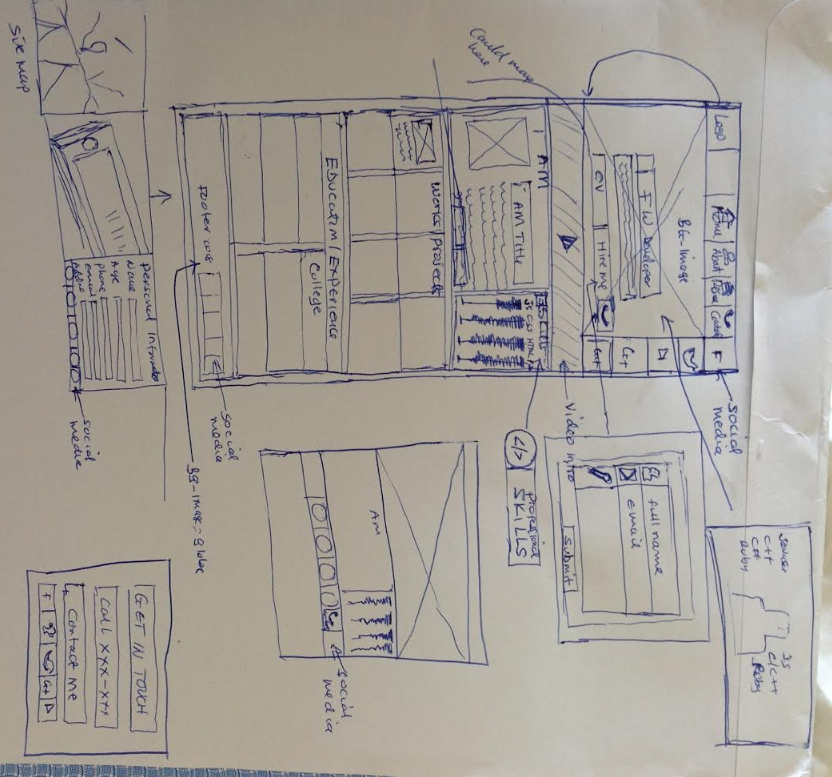
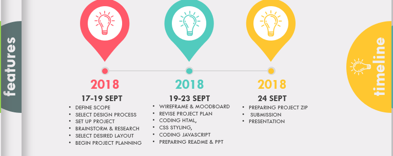

# My Portfolio
Stephen Kel's Portfolio Website 2018
## Link to portfolio

## Link to GitHub repo
https://github.com/S-Kel/Portfolio

## Description

### Purpose
The purpose is to develop a portfolio static web App to meet diploma requirement, and be able to showcase my works to potential employers, students, and any relevant stakeholders.
### Functionality / features
Currently, the App displays the following at minimum:
* My name and contact details.
* Links to social media such as Github, twitter, Google+, LinkedIn, Youtube
* A brief Bio demonstrating my personality
* Professional Skills in a Progressive Form
* Education & Work history

### Sitemap
### Screenshots

### Target audience
* Potential Employers
* Lecturers
* Students
* All other Stakeholders 

### Tech stack (e.g. html, css, deployment platform, etc)
A range of Tech stack were used to develop a static application. This includes:
* HTML for the portfolio Layout
* CSS for styling the App
* JavaScript to add desired behaviors to the Pages.
In future, dynamic features will be added to add dynamism & scalability to the App. This expected to happen after learning Ruby on rails and Node & Reacts in the next semesters. 

## Design documentation
### Design process
Prior to commencement,  a design process was chosen to deliver portfolio website in the following stages: 
1. Define the Portfolio Website
2. Scope the Portfolio website
3. Develop initial Visual Design using wireframe & moodboard
4. Undertake the site development
5. Undertake the site testing  and launch
6. Future considerations including Site maintenance & scalability

### Wireframes

### Personal logo (optional)

### Usability considerations

## Details of planning process
A deeper understanding of key project requirements was undertaken by carefully going through the Portfolio guideline document to gauge the the project scope, and identified the targeted audience. A clear project scope of work was then developed followed by brainstorming and researching to select the desired page layout, and other relevant visual design effect.  Utilizing the project scope, the Design was then broken down into small deliverable tasks and cards with clear deadlines, and the trello web Application was used to aid with planning process. A Project was then created on the development PC as well as on Github including the associated  folders and Repos before moving on the project implementation stage. Project wireframes were hand sketched, and photoshop was used to prepare the project Logo and moodboard.
### Project plan & timeline

### Screenshots of Trello board(s)

## Short Answer Q&A - Include short answers to the following questions,
1. Describe key events in the development of the internet from the 1980s to today (max. 150 words)
- Internet has evolved considerably from its humble beginning in the 1972s.
- 1973-1983, TCP/IP was developed standard setting model for data transmission between multiple networsk
- The term internet was invented in 1982.
- World Wide Wibe was invented by computer scientist, Sir Tim Berners
- 1991, CERB launces the first website http://info.cern.ch/hypertext/www/TheProject.html
- 1992, first internet dial-up service was introduced by Pipex
- Daily Telegraph launched Britain's first newspaper website - tegraph.co.uk
- 1999, p2p music file-sharing site Napster begins operation
- 2000, Telewest launches the first mass-market broadband service
- 2007, BBC launches TV and radio catch-up service iPlayer
- 2007, first iPhone launches, delivering the internet in your pocket
- In future, the internet of Things will fully mature allowing us to connect more our appliances to the internet
- During 80s, networks widely deployed initially to support scientific research.
- Early 1990s, invention of web made it more easier for users to 
	- publish & access information- this set off rapid growth of the internet
-

2.  Define and describes the relationship between fundamental aspects of the internet such as: domains, web servers, DNS, and web browsers (max. 150 words)
3.  Reflect on one aspect of the development of internet technologies and how it has contributed to the world today (max. 150 words)
- internet has revolutionized the computer & communications world
- Internet has revolutinizeed broadcasting capability, information dissimination, collaboration and interaction between individuals and their PC
- 
