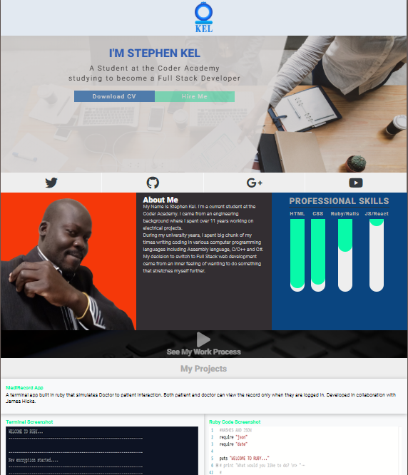
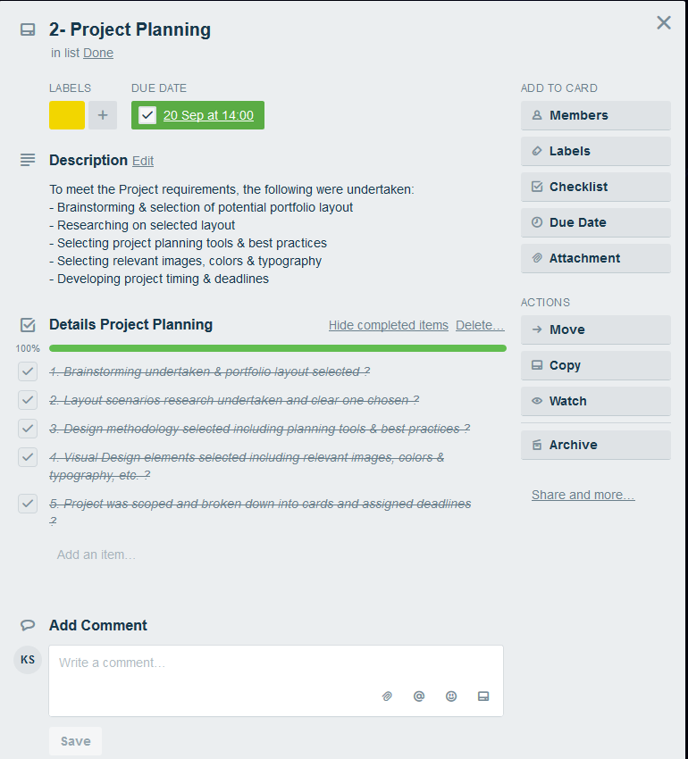

# My Portfolio
Stephen Kel's Portfolio Website 2018
## Link to portfolio
https://s-kel.github.io/Portfolio/
## Link to GitHub repo
https://github.com/S-Kel/Portfolio

## Description
### Purpose
The purpose is to develop a portfolio static web App to meet diploma requirement, and be able to showcase my works to potential employers, students, and any relevant stakeholders.
### Functionality / features
Currently, the App displays the following at minimum:
* My name and contact details.
* Links to social media such as Github, twitter, Google+, LinkedIn, Youtube
* A brief Bio demonstrating my personality
* Professional Skills in a Progressive Form
* Education & Work history

### Sitemap
### Screenshots

### Target audience
* Potential Employers
* Lecturers
* Students
* All other Stakeholders 

### Tech stack (e.g. html, css, deployment platform, etc)
A range of Tech stack were used to develop a static application. This includes:
* HTML for the portfolio Layout
* CSS for styling the App
* JavaScript to add desired behaviors to the Pages.
In future, dynamic features will be added to add dynamism & scalability to the App. This expected to happen after learning Ruby on rails and Node & Reacts in the next semesters. 

## Design documentation
### Design process
Prior to commencement,  a design process was chosen to deliver portfolio website in the following stages: 
1. Define the Portfolio Website
2. Scope the Portfolio website
3. Develop initial Visual Design using wireframe & moodboard
4. Undertake the site development
5. Undertake the site testing  and launch
6. Future considerations including Site maintenance & scalability

### Wireframes

### Personal logo (optional)

### Usability considerations

## Details of planning process
A deeper understanding of key project requirements was undertaken by carefully going through the Portfolio guideline document to gauge the the project scope, and identified the targeted audience. A clear project scope of work was then developed followed by brainstorming and researching to select the desired page layout, and other relevant visual design effect.  Utilizing the project scope, the Design was then broken down into small deliverable tasks and cards with clear deadlines, and the trello web Application was used to aid with planning process. A Project was then created on the development PC as well as on Github including the associated  folders and Repos before moving on the project implementation stage. Project wireframes were hand sketched, and photoshop was used to prepare the project Logo and moodboard.
### Project plan & timeline

### Screenshots of Trello board(s)

## Short Answer Q&A - Include short answers to the following questions,
1. Describe key events in the development of the internet from the 1980s to today (max. 150 words)
>The internet has come along way since its inception in the 1970s. The period from 1980 to current ushers in major events including the development of TCP/IP, the invention of World Wide Web, the launching of the first website by CERB, the introduction of first dial-up service by Pipex, the launching of Britain's first internet news Website- tegraph.co.uk, the introduction of first peer-to-peer(P2P) Music file-sharing site by Napste, the launching of BBC TV and radio catch-up service iPlayer, and the launching of first iPhone delivering the internet in your pocket.

2.  Define and describes the relationship between fundamental aspects of the internet such as: domains, web servers, DNS, and web browsers (max. 150 words)
>Domains refers to names of the website or URL and sometimes called the host name, and easy to remember than IP Address of website. Web servers are Computers that are usually set up in facilities called data centers and operated by hosting companies to store websites that people can visit on the internet. Webservers communicate with many browsers on many computers at all time to serve files, as requested. Domains Name System converts translates domain names into IP Address thus allowing access internet location by its domain name. The Web Browsers i.e. firefox, Safari, Chrome, Internet Explorer are responsible for reading the files stored on web servers and convert files into images and text to view. Web Browsers communicate with web servers to bring information from the internet.

3.  Reflect on one aspect of the development of internet technologies and how it has contributed to the world today (max. 150 words)
>The inernet has revolutionized the computer & communications world enormously more importantly it has revolutinizeed broadcasting capability, information dissimination, collaboration and interaction between individuals and their PC.
